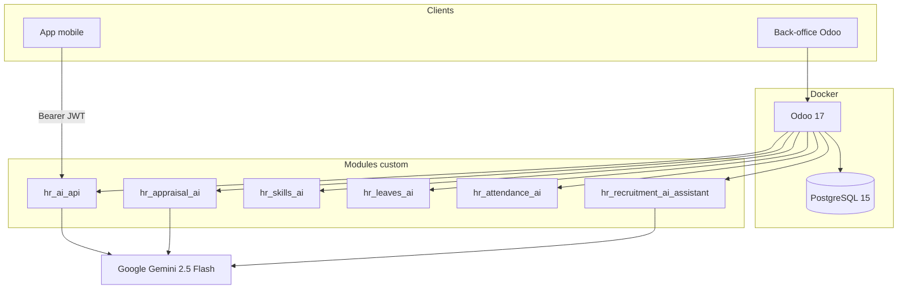

# Smart HR AI — Assistant RH & Recrutement intelligent (Odoo 17)

> Plateforme RH construite sur **Odoo 17** qui automatise le recrutement, les congés, les présences, les compétences et les évaluations, avec une couche d'IA (**Google Gemini**) et une **API REST/JWT** exposée à une application mobile.


---

## 📌 Aperçu

Les processus RH classiques (tri de CV, matching poste/candidat, suivi des congés, des présences et des évaluations) restent souvent manuels et peu lisibles pour les collaborateurs. **Smart HR AI** automatise ce cycle de vie RH de bout en bout dans Odoo, et l'expose de façon sécurisée à une application mobile.

Ce dépôt contient les **modules Odoo custom** (`custom_addons/`) et l'environnement **Docker** (Odoo 17 + PostgreSQL 15). Le code source de l'application mobile React n'est pas inclus : ce backend en constitue l'API.

### Ce que le projet automatise

| Besoin | Réponse apportée |
|---|---|
| Accélérer le recrutement | Pipeline ATS automatisé, extraction de CV, scoring par IA |
| Aider la décision RH | Recommandations (congés, compétences, évaluations, résumé hebdomadaire) |
| Assurer la continuité candidat → employé | Embauche, contrat, onboarding assisté par IA, accès mobile |
| Donner de la visibilité aux collaborateurs | API REST `/api/v1/*` avec comptes dédiés |

---

## 🧱 Stack technique

| Couche | Technologie |
|---|---|
| ERP | Odoo 17.0 |
| Base de données | PostgreSQL 15 |
| Conteneurisation | Docker Compose |
| IA générative | Google Gemini 2.5 Flash |
| Extraction de CV | pdfplumber, python-docx, Tesseract OCR, pdf2image |
| API / Auth | PyJWT (HS256), Werkzeug (hash PBKDF2) |

La configuration applicative (clé Gemini, secrets, seuils) est stockée dans les paramètres système Odoo (`ir.config_parameter`), pas dans un fichier `.env`.

---

## 🏗️ Architecture



Les modules métier (`hr_recruitment_ai_assistant`, `hr_skills_ai`, `hr_leaves_ai`, `hr_attendance_ai`, `hr_appraisal_ai`) portent la logique RH ; `hr_ai_api` expose cette logique en JSON/JWT sans contenir de règles métier propres.

### Structure du dépôt

```text
Rh_automatise/
├── Dockerfile                 # Image odoo:17.0 + Tesseract + libs Python
├── docker-compose.yml         # Services web (Odoo) + db (PostgreSQL 15)
└── custom_addons/
    ├── hr_recruitment_ai_assistant/   # Recrutement IA, pipeline ATS, onboarding
    ├── hr_skills_ai/                  # Compétences, gap analysis, formations
    ├── hr_leaves_ai/                  # Recommandation congés (heuristique)
    ├── hr_attendance_ai/              # Retards, anomalies de présence
    ├── hr_appraisal_ai/               # Évaluations (score Gemini + fallback)
    └── hr_ai_api/                     # API REST, JWT, dashboard, accès mobile
```

---

## ✨ Fonctionnalités principales

**Recrutement**
- Extraction de CV (PDF/DOCX) avec OCR si le document est scanné
- Analyse structurée par IA : compétences, diplômes, expériences, langues
- Scoring 0–100, recommandation et historique
- Génération de questions d'entretien et de fiches de poste
- Détection de doublons et embauche → création employé + contrat + onboarding

**Employés & onboarding**
- Transfert des données candidat vers la fiche employé
- Tâches d'onboarding automatiques et évaluation initiale

**Compétences & formations**
- Matrice poste ↔ compétences, analyse d'écart, parcours de carrière

**Congés & présences**
- Recommandation à la création (solde, conflits d'équipe)
- Détection automatique des retards et anomalies

**Évaluations & pilotage RH**
- Score IA et détection des hauts potentiels
- Tableau de bord et résumé hebdomadaire généré par IA

**Application mobile**
- Profil, congés, présences, compétences, évaluations, documents RH, résumé RH selon le rôle

---

## 🚀 Installation

### Prérequis
- Git
- Docker Desktop (ou Docker Engine + Compose)

### 1. Cloner le projet

```bash
git clone https://github.com/<votre-utilisateur>/Rh_automatise.git
cd Rh_automatise
```

### 2. Lancer les conteneurs

```bash
docker compose up -d --build
```

| Service | Description |
|---|---|
| `web` | Odoo 17, exposé sur `http://localhost:8070` |
| `db` | PostgreSQL 15 |

### 3. Configurer Odoo

1. Ouvrir [http://localhost:8070](http://localhost:8070)
2. Créer une base de données
3. Activer le **mode développeur**
4. Applications → **Mettre à jour la liste des applications**
5. Installer `hr_ai_api` (tire automatiquement les modules dépendants)

### 4. Activer l'IA

Dans **Recrutement → Configuration → Assistant RH IA**, renseigner une clé API [Google AI Studio](https://aistudio.google.com/). Sans clé valide, le pipeline de recrutement échoue et les évaluations basculent sur un mode heuristique (sans IA).

> ⚠️ Ne commitez jamais de clé API réelle. Utilisez toujours une clé placée dans les paramètres système Odoo, jamais dans le code ou le dépôt Git.

### 5. Tester l'API

```bash
curl -X POST http://localhost:8070/api/v1/auth/token \
  -H "Content-Type: application/json" \
  -d '{"login":"admin","password":"<votre_mot_de_passe>"}'
```

---

## 🔌 API REST (aperçu)

Toutes les routes sont préfixées par `/api/v1/` et utilisent une authentification par **Bearer JWT** (hors login).

| Domaine | Exemples d'endpoints |
|---|---|
| Authentification | `POST /auth/token`, `POST /auth/refresh`, `GET /auth/me` |
| Employés | `GET /employees/<id>` |
| Congés | `GET/POST /leaves` |
| Présences | `GET /attendance/<employee_id>` |
| Compétences | `GET /employees/<id>/skills-gap` |
| Évaluations | `GET /appraisals/<employee_id>`, `POST /appraisals/generate` |
| Documents RH | `GET/POST /documents` |
| Résumé RH | `GET /weekly-summary/latest` |

Chaque endpoint est protégé par un système de **scopes** liés au rôle (`rh`, `manager`, `employee`), et un employé n'accède qu'à ses propres données.

---

## 🧪 Tests

Des tests automatisés couvrent le pipeline de recrutement (`custom_addons/hr_recruitment_ai_assistant/tests/`), avec les appels à l'IA mockés :

```bash
docker compose exec web odoo -d <votre_base> --test-enable --stop-after-init -u hr_recruitment_ai_assistant
```

---

## 🗺️ Roadmap

- Unifier les différents clients d'appel à Gemini
- Ajouter un endpoint d'approbation des congés côté API
- Étoffer la couverture de tests (API, modules hors recrutement)
- Mettre en place une pipeline CI
- Générer une documentation OpenAPI
- Durcir davantage la sécurité de l'API (rate limiting, logs, gestion des secrets)

---

## 📄 Licence

Modules custom sous licence **LGPL-3** (voir les fichiers `__manifest__.py` de chaque module).

---

## 👥 Équipe

Projet réalisé en équipe dans le cadre d'un projet académique.

- [Yassine Laamarti](https://github.com/yassinelaamarti)
- [Zouguari Yassine](https://github.com/Zouguari)
- [Zakariyae Elhandi](https://github.com/ZakariyaeElhandi)

Voir la liste complète sur la page [Contributors](https://github.com/ZakariyaeElhandi/smart-hr-mobile/graphs/contributors).
