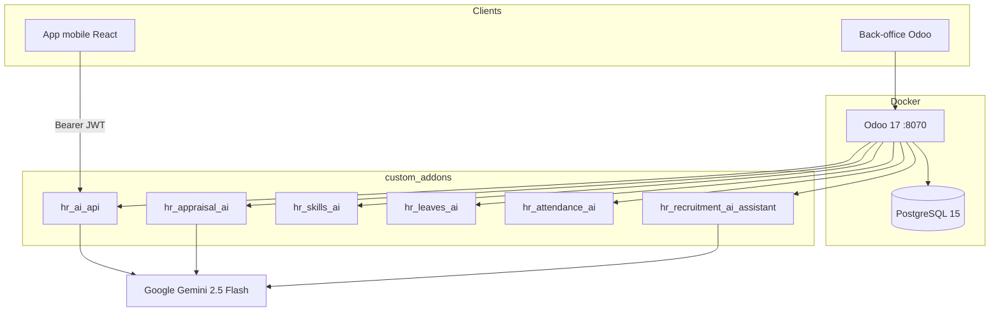
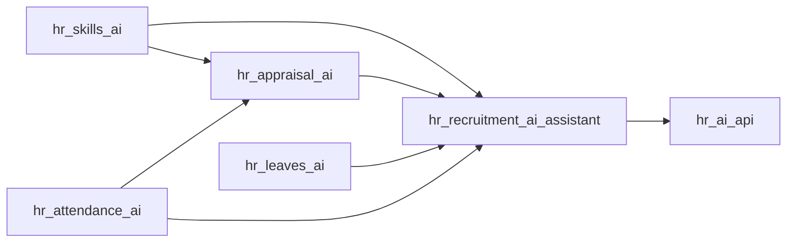

# Smart HR AI — Assistant RH & Recrutement IA (Odoo 17)

Plateforme RH construite sur **Odoo 17** : automatisation du recrutement, analyse IA (Google Gemini), gestion des compétences, congés, présences et évaluations, exposée à une **application mobile** via une API REST JWT.

Ce dépôt contient les **modules Odoo custom** (`custom_addons/`) et l’environnement **Docker** (Odoo 17 + PostgreSQL 15). L’application mobile React n’est pas dans ce repository : ce backend en constitue l’API.

---

## Table des matières

1. [Contexte et objectifs](#1-contexte-et-objectifs)
2. [Technologies](#2-technologies)
3. [Architecture](#3-architecture)
4. [Structure du dépôt](#4-structure-du-dépôt)
5. [Modules custom](#5-modules-custom)
6. [Fonctionnalités](#6-fonctionnalités)
7. [Intelligence artificielle](#7-intelligence-artificielle)
8. [Sécurité et authentification](#8-sécurité-et-authentification)
9. [API REST](#9-api-rest)
10. [Intégration mobile](#10-intégration-mobile)
11. [Installation et lancement](#11-installation-et-lancement)
12. [Configuration](#12-configuration)
13. [Tests](#13-tests)
14. [État actuel, limites et perspectives](#14-état-actuel-limites-et-perspectives)

---

## 1. Contexte et objectifs

### Problématique

Les processus RH (tri de CV, matching poste/candidat, onboarding, suivi des congés et des présences, évaluations) restent souvent manuels, fragmentés et peu lisibles pour le collaborateur. L’objectif du projet (PFA) est d’**automatiser le cycle de vie RH** dans Odoo tout en offrant un **canal mobile** sécurisé.

### Objectifs

| Objectif | Réponse dans le projet |
|----------|------------------------|
| Accélérer le recrutement | Pipeline ATS automatisé + extraction CV + scoring Gemini |
| Aider la décision RH | Recommandations (congés, compétences, évaluations, résumé hebdomadaire) |
| Continuité candidat → employé | Embauche, contrat, onboarding IA, accès mobile |
| Exposer les données aux collaborateurs | API REST `/api/v1/*` + comptes `hr.employee.credentials` |
| Séparer métier et exposition | Modules métier sans routes HTTP ; `hr_ai_api` pour l’API |

### Solution proposée

Un **socle Odoo 17** (modules standards `hr`, `hr_recruitment`, `hr_holidays`, `hr_attendance`, `hr_skills`, `hr_contract`, `project`) enrichi de **6 modules custom**, plus Gemini (`gemini-2.5-flash`) pour les cas où un LLM apporte une valeur réelle, et des **heuristiques** ailleurs (congés, retards).

---

## 2. Technologies

| Couche | Technologie | Source dans le dépôt |
|--------|-------------|----------------------|
| ERP | **Odoo 17.0** | `Dockerfile` : `FROM odoo:17.0` |
| Base de données | **PostgreSQL 15** | `docker-compose.yml` |
| Conteneurisation | Docker Compose 3.8 | `docker-compose.yml` |
| IA | Google Gemini **gemini-2.5-flash** | `hr_applicant.py`, `hr_recruitment_ai.py`, `hr_appraisal.py`, `hr_weekly_summary.py` |
| Extraction CV | pdfplumber, python-docx, Tesseract OCR, pdf2image | `Dockerfile` + `hr_applicant.py` |
| API / JWT | PyJWT (HS256) | `hr_ai_api/utils/jwt_helper.py` |
| Hash mots de passe mobile | Werkzeug (PBKDF2) | `hr_employee_credentials.py` |
| Client HTTP Gemini (recrutement) | `requests` | `hr_applicant.py` |
| Client HTTP Gemini (évaluations) | `urllib.request` | `hr_appraisal.py` |

Il n’y a **pas** de `requirements.txt` ni de fichier `.env` : les dépendances Python sont installées dans le `Dockerfile`, la configuration applicative est stockée dans **`ir.config_parameter`** (Odoo).

---

## 3. Architecture

```text
Application mobile (React, hors dépôt)
        │  JSON REST  /api/v1/*
        ▼
hr_ai_api  (JWT, scopes, contrôleurs HTTP)
        │
        ▼
Odoo 17
  ├── Modules standards (hr, recrutement, congés, présences, compétences…)
  └── Modules custom métier
        ├── hr_recruitment_ai_assistant
        ├── hr_skills_ai
        ├── hr_leaves_ai
        ├── hr_attendance_ai
        └── hr_appraisal_ai
        │
        ▼
PostgreSQL 15
        │
        └── Gemini 2.5 Flash (appels HTTPS sortants)
```



### Rôle des couches

| Couche | Rôle |
|--------|------|
| **Back-office Odoo** | Recruteurs et RH : pipeline ATS, menus Smart HR AI, validations (congés, contrats), génération manuelle des résumés |
| **App mobile** | Employés / managers : profil, congés, présences, compétences, évaluations, documents, résumé RH (selon rôle) |
| **`hr_ai_api`** | Authentification JWT, scopes, sérialisation JSON, pont vers les modèles métier — **pas** de logique RH métier principale |
| **Modules métier** | Champs IA, crons, emails, onboarding, heuristiques |
| **PostgreSQL** | Persistance Odoo (modèles, ACL, cron, jetons hashés) |
| **Gemini** | Extraction CV, scoring, questions d’entretien, matching de poste, descriptions de poste, évaluations, résumé hebdomadaire |

### Graphe de dépendances des modules



Installer **`hr_ai_api`** tire l’ensemble de la chaîne (via `hr_recruitment_ai_assistant` et les modules RH).

---

## 4. Structure du dépôt

```text
Rh_automatise/
├── Dockerfile                 # Image odoo:17.0 + Tesseract + libs Python
├── docker-compose.yml         # Services web (Odoo) + db (PostgreSQL 15)
├── .gitignore
├── README.md
└── custom_addons/             # Addons montés dans /mnt/extra-addons
    ├── hr_recruitment_ai_assistant/
    ├── hr_skills_ai/
    ├── hr_leaves_ai/
    ├── hr_attendance_ai/
    ├── hr_appraisal_ai/
    └── hr_ai_api/
```

Dossier **`odoo/`** (sources officielles Odoo, optionnel pour l’IDE) : ignoré par Git. Il n’est **pas** utilisé par Docker (l’image officielle `odoo:17.0` suffit).

---

## 5. Modules custom

| Module | Version manifeste | Type | Responsabilité |
|--------|-------------------|------|----------------|
| `hr_recruitment_ai_assistant` | 1.0.0 | Application | Recrutement IA, pipeline ATS, onboarding |
| `hr_skills_ai` | 17.0.1.0.0 | Technique | Compétences requises par poste, formations, gap analysis |
| `hr_leaves_ai` | 17.0.1.0.0 | Technique | Recommandation congés (heuristique) |
| `hr_attendance_ai` | 17.0.1.0.0 | Technique | Retards, anomalies, cron quotidien |
| `hr_appraisal_ai` | 17.0.1.0.0 | Technique | Modèle `hr.appraisal`, score Gemini + fallback |
| `hr_ai_api` | 17.0.1.2.0 | Technique | API REST, JWT, dashboard, accès mobile, documents, résumé hebdo |

### 5.1 `hr_recruitment_ai_assistant`

Dépend de : `hr`, `hr_recruitment`, `project`, `hr_contract`, `hr_skills_ai`, `hr_appraisal_ai`, `hr_leaves_ai`, `hr_attendance_ai`.

**Modèles principaux**

| Modèle | Type | Rôle |
|--------|------|------|
| `hr.applicant` | héritage | Pipeline IA, CV, scoring, emails, embauche |
| `hr.job` | héritage | Compétences / expérience / niveau d’études requis |
| `hr.recruitment.stage` | héritage | Rôles : entretien, refus, contrat signé |
| `hr.employee` | héritage | Données IA transférées, onboarding |
| `hr.contract` | héritage | Email d’acceptation à l’état `open` |
| `hr.recruitment.ai.generator` | nouveau | Génération de fiches de poste |
| `hr.applicant.score.history` | nouveau | Historique des scores |
| `hr.applicant.interview` | nouveau | Historique des entretiens (RH / technique) |
| `hr.recruitment.ai.settings` | transient | Clé Gemini + auto-pipeline |
| `project.task` | héritage | Lien `applicant_origin_id` (tâches d’onboarding) |

**Pipeline ATS standard** (configuré au `post_init_hook`, réparable manuellement) :

1. Nouveau  
2. Qualification initiale  
3. Entretien RH (`is_interview_stage` + `interview_type=rh`)  
4. Entretien Technique  
5. Proposition de contrat  
6. Contrat signé (`is_contract_signed_stage`)  
7. Refusé (`is_refusal_stage`)

**Cron** : `_cron_auto_process_new_applicants` toutes les **15 minutes** (candidatures `pending` avec CV, si `smart_hr_ai.auto_run_pipeline_on_create=1`).

### 5.2 `hr_skills_ai`

Dépend de : `hr_skills`.

| Modèle | Rôle |
|--------|------|
| `hr.job.skill` | Compétence + niveau requis par `hr.job` |
| `hr.training.course` | Catalogue de formations liées à une compétence |
| `hr.employee` | `get_skill_gap_analysis()`, `get_career_path()` |
| Wizard gap | Analyse à la demande dans le back-office |

L’analyse n’est **pas persistée** : elle est recalculée selon le poste cible.

### 5.3 `hr_leaves_ai`

Dépend de : `hr_holidays`.

Enrichit `hr.leave` : `ai_recommendation` (`approve` / `caution` / `refuse`), justification, conflits d’équipe, horodatage. Historique dans `hr.leave.ai.recommendation`. Calcul automatique à la création. **Pas d’appel Gemini.**

### 5.4 `hr_attendance_ai`

Dépend de : `hr_attendance`.

- Champs calculés stockés sur `hr.attendance` : `is_late`, `late_minutes`, `anomaly_type`
- Modèle `hr.attendance.anomaly` : checkout manquant, retards répétés, **signalement employé** (`user_reported`)
- Cron quotidien `_cron_detect_attendance_anomalies`

### 5.5 `hr_appraisal_ai`

Dépend de : `hr`, `hr_attendance_ai`, `hr_skills_ai`.

Modèle **propre** `hr.appraisal` (pas le module Enterprise `hr_appraisal` d’Odoo) : score, haut potentiel, synthèse, historique `hr.appraisal.ai.analysis`. Gemini si clé API, sinon moyenne heuristique (recrutement + compétences + ponctualité).

### 5.6 `hr_ai_api`

Dépend de : `base`, `mail`, `hr`, `hr_recruitment_ai_assistant`, `hr_holidays`, `hr_leaves_ai`, `hr_attendance`, `hr_attendance_ai`, `hr_skills`, `hr_skills_ai`, `hr_appraisal_ai`. Dépendance Python : **PyJWT**.

| Modèle | Rôle |
|--------|------|
| `api.auth.token` | Empreinte SHA-256 des refresh tokens |
| `hr.employee.credentials` | Login mobile (découplé de `res.users`) |
| `smart.hr.ai.dashboard` | Métriques agrégées (compute) |
| `hr.weekly.summary` | Résumé hebdomadaire Gemini |
| `hr.document.request` | Demandes de documents RH |
| `hr.applicant` (héritage) | Email d’accès mobile après félicitations |

Menus back-office sous **Employés → Smart HR AI** (dashboard, résumés, congés IA, présences, compétences, évaluations) et **Accès Mobile Employés**.

---

## 6. Fonctionnalités

### Recrutement

- Extraction texte CV (PDF / DOCX) + **OCR** si PDF scanné (`fra+eng`)
- Analyse structurée Gemini (résumé, compétences **avec niveau**, diplômes, niveau d’études normalisé **contexte marocain**, expériences, langues, certifications)
- Scoring 0–100 + recommandation + compétences matchées / manquantes + historique
- Suggestion de poste ouvert (jamais assignée automatiquement)
- Génération de questions d’entretien **RH** ou **techniques** selon l’étape
- Planification calendrier (lendemain 10h par défaut) + email de convocation
- Détection de doublons (email, téléphone, nom) + wizard de fusion
- Import en masse de candidatures (wizard)
- Générateur de descriptions de poste (HTML)
- Emails : étapes (template), convocation, refus (motif), **félicitations** à la validation du contrat
- Passage à **Contrat signé** : création employé, contrat, passage `state=open`, onboarding, **compte mobile + 2e email**
- Blocage si un employé **actif** existe déjà (même email/nom) — pas de réutilisation silencieuse

### Employés et onboarding

- Transfert des données IA candidat → fiche employé
- Peuplement `hr.employee.skill` avec un niveau réaliste (débutant → expert)
- Tâches projet « Onboarding RH » (6 tâches types)
- Rattachement au département du poste
- Évaluation initiale + formations suggérées pour les lacunes
- Accès mobile : génération, reset, `must_change_password`

### Compétences et formations

- Matrice poste ↔ compétences / niveaux
- Analyse d’écart + parcours vers un poste cible
- Catalogue `hr.training.course`

### Congés

- Recommandation à la création (solde + conflits département)
- Seuil de conflits configurable (`hr_leaves_ai.conflict_threshold`, défaut **2**)
- **Approbation réelle** = workflow Odoo `hr_holidays` (pas d’auto-validation IA)
- API : lister / créer / consulter — **pas** d’endpoint d’approbation

### Présences

- Retard vs calendrier de travail (marge `hr_attendance_ai.grace_minutes`, défaut **10**)
- Anomalies automatiques + réclamations mobile
- Calendrier mensuel API (pointages, congés, anomalies, heures)

### Évaluations

- Score IA, haut potentiel (seuil `hr_appraisal_ai.high_potential_threshold`, défaut **75**)
- Génération back-office ou via API (`appraisals:write`)

### Analyse RH

- Tableau de bord Smart HR AI (effectifs « recrutés IA », onboarding, scores moyens, anomalies, congés IA, dernier résumé)
- Résumé hebdomadaire (cron lundi + aperçu quotidien de la semaine en cours)

### Documents RH (mobile + back-office)

Types : attestation de travail, bulletin de paie, certificat, salaire, CNSS, contrat, autre. Statuts : pending → processing → ready / delivered / rejected. Téléchargement fichier une fois prêt.

---

## 7. Intelligence artificielle

**Modèle** : `gemini-2.5-flash` — URL `https://generativelanguage.googleapis.com/v1beta/models/gemini-2.5-flash:generateContent`  
**Clé** : paramètre système `smart_hr_ai.gemini_api_key` (écran **Configuration Assistant RH IA**).

### Cas d’usage réellement implémentés

| Cas | Module | Entrées Odoo | Sortie exploitée |
|-----|--------|--------------|------------------|
| Extraction CV | `hr_recruitment_ai_assistant` | Texte brut du CV | Champs extraits + `extracted_skills_detailed` JSON |
| Scoring matching | idem | Offre (`hr.job`) + profil extrait | `ai_score`, recommandation, historique |
| Questions entretien | idem | Profil + poste + type d’étape | `ai_interview_questions` |
| Suggestion de poste | idem | Profil + postes ouverts | `ai_suggested_job_id` (manuel) |
| Fiche de poste | `hr.recruitment.ai.generator` | Titre + mots-clés | HTML missions / skills / profil / avantages |
| Évaluation performance | `hr_appraisal_ai` | Recrutement, skills, présences, onboarding | Score, synthèse, haut potentiel |
| Résumé hebdomadaire | `hr_ai_api` | Agrégats RH de la période | JSON headline, highlights, commentaires, alertes |

### Préparation des données et robustesse (recrutement)

- Prompts JSON stricts, `response_mime_type: application/json`, `thinkingBudget: 0`
- Retry HTTP **uniquement** 429/503 et erreurs réseau
- Retry parsing JSON (`GeminiRetryableError`) + réparation virgules finales
- Fallback OCR si PDF sans texte

### Heuristiques (pas de LLM)

- Congés : solde vs jours demandés, conflits d’équipe
- Présences : heure locale vs `resource_calendar_id`, checkout manquant, retards répétés
- Skills gap : comparaison niveaux Odoo + texte extrait
- Évaluation : fallback moyenne si Gemini indisponible

### Limites de l’IA (code actuel)

- Qualité liée au CV extractible et au quota Gemini
- Trois implémentations d’appel Gemini (requests recrutement, urllib évaluations, requests résumé) — pas un client unique
- Congés / présences : règles, pas de LLM
- Le résumé hebdomadaire n’est **pas** généré depuis le mobile (lecture seule, scope `analytics:read`)

---

## 8. Sécurité et authentification

### Comptes mobile vs Odoo

Deux modes d’auth API (`POST /api/v1/auth/token`) :

1. **`hr.employee.credentials`** (prioritaire) : login = email, mot de passe hashé, `is_active`, `must_change_password`
2. **Fallback `res.users`** : login Odoo (RH / admin / démo)

Les refresh tokens sont **opaques** (pas JWT) ; seule l’empreinte SHA-256 est en base (`api.auth.token`).

### Jetons

| Jeton | Durée | Stockage |
|-------|--------|----------|
| Access JWT HS256 | **45 minutes** | Côté client uniquement |
| Refresh | **30 jours** | Hash en base, révocable |

Claims JWT : `sub`, `user_id`, `employee_id`, `scopes`, `role`, `must_change_password`, `iat`, `exp`.  
Secret : `hr_ai_api.jwt_secret` (généré au premier usage / `post_init_hook`).

### Flux

```text
1. POST /api/v1/auth/token  { login, password, device? }
2. Réponse : access_token, refresh_token, expires_in, scope, must_change_password
3. Requêtes métier : Authorization: Bearer <access_token>
4. 401 token_expired → POST /api/v1/auth/refresh  (l’ancien refresh est révoqué, rotation)
5. Déconnexion : POST /api/v1/auth/revoke
```

Changement de mot de passe : `POST /api/v1/auth/change-password` (longueur minimale **6** caractères).

### Rôles et scopes (`utils/roles.py`)

| Rôle JWT | Groupe Odoo | Scopes |
|----------|-------------|--------|
| `rh` | `hr.group_hr_manager` | BASE + manager + `employees:write`, `analytics:read`, `admin:*` |
| `manager` | `hr.group_hr_user` | BASE + `leaves:approve`, `attendance:team_read`, `appraisals:write` |
| `employee` | autres | BASE uniquement |

**BASE** : `profile:read`, `leaves:read/write`, `attendance:read/write`, `skills:read`, `appraisals:read`.

Le décorateur `@require_auth([scopes])` exige au moins un scope (ou `admin:*`). Un employé est en plus **filtré** sur son `employee_id` (fiche, congés, présences, compétences, évaluations).

**Note** : le scope `leaves:approve` est **déclaré** mais **aucun endpoint d’approbation** n’existe. Les documents utilisent `@require_auth()` sans scope (tout token valide + contrôle `employee_id`).

### ACL Odoo (extrait)

- Credentials mobile : lecture/écriture RH manager ; RH user lecture + écriture limitée (pas unlink)
- Résumés hebdo : RH user lecture ; RH manager CRUD
- Demandes documents : utilisateurs internes + RH

Les contrôleurs API s’appuient largement sur **`.sudo()`** : la sécurité HTTP repose sur JWT + filtres métier, pas sur les record rules Odoo du user mobile.

---

## 9. API REST

Toutes les routes sont `type='http'`, `auth='none'`, `csrf=False` : **JSON brut** (pas JSON-RPC Odoo). Base : `http://localhost:8070`.

Erreurs typiques : `{ "error": "<code>", "message": "..." }` avec statut HTTP 400/401/403/404/500.

### Authentification

| Méthode | Endpoint | Description | Auth |
|---------|----------|-------------|------|
| POST | `/api/v1/auth/token` | Login / mot de passe → tokens | Non |
| POST | `/api/v1/auth/refresh` | Nouveau couple de tokens | Non (refresh) |
| POST | `/api/v1/auth/revoke` | Révocation du refresh | Non |
| GET | `/api/v1/auth/me` | Profil + rôle + scopes | Bearer |
| POST | `/api/v1/auth/change-password` | Nouveau mot de passe | Bearer |

### Employés

| Méthode | Endpoint | Description | Scope |
|---------|----------|-------------|-------|
| GET | `/api/v1/employees/<id>` | Fiche (nom, poste, département, manager, email, téléphone) | `profile:read` ou `employees:write` |

### Congés

| Méthode | Endpoint | Description | Scope |
|---------|----------|-------------|-------|
| GET | `/api/v1/leaves` | Liste (employé : les siens ; sinon département) | `leaves:read` |
| POST | `/api/v1/leaves` | Création (`holiday_status_id`, `date_from`, `date_to`, `reason?`) | `leaves:write` |
| GET | `/api/v1/leaves/<id>` | Détail + recommandation IA | `leaves:read` |

### Présences

| Méthode | Endpoint | Description | Scope |
|---------|----------|-------------|-------|
| GET | `/api/v1/attendance/<employee_id>` | Mois (`month`, `year`) : pointages, congés, anomalies, totaux | `attendance:read` |
| POST | `/api/v1/attendance/anomaly` | Réclamation (date, commentaire, pièce jointe optionnelle) | `attendance:read` |
| GET | `/api/v1/attendance/anomalies/my` | Réclamations de l’employé connecté | `attendance:read` |

### Compétences et formations

| Méthode | Endpoint | Description | Scope |
|---------|----------|-------------|-------|
| GET | `/api/v1/employees/<id>/skills` | Compétences Odoo | `skills:read` |
| GET | `/api/v1/employees/<id>/skills-gap` | Écart (`target_job_id` optionnel) | `skills:read` |
| GET | `/api/v1/employees/<id>/training-recommendations` | Formations recommandées | `skills:read` |
| GET | `/api/v1/employees/<id>/career-path` | Parcours (`target_job_id` **requis**) | `skills:read` |

### Évaluations

| Méthode | Endpoint | Description | Scope |
|---------|----------|-------------|-------|
| GET | `/api/v1/appraisals/<employee_id>` | Liste des évaluations | `appraisals:read` |
| POST | `/api/v1/appraisals/generate` | Créer + lancer l’IA (`employee_id` optionnel) | `appraisals:write` |
| GET | `/api/v1/appraisals/<appraisal_id>/analysis` | Détail (génère l’IA si absente) | `appraisals:read` |
| GET | `/api/v1/appraisals/high-potentials` | Hauts potentiels (RH : tous ; sinon département) | `analytics:read` |

### Documents

| Méthode | Endpoint | Description | Auth |
|---------|----------|-------------|------|
| GET | `/api/v1/documents/my` | Demandes de l’employé | Bearer |
| POST | `/api/v1/documents/request` | Nouvelle demande | Bearer |
| GET | `/api/v1/documents/<id>/download` | Fichier (si prêt et propriétaire) | Bearer |

### Résumé hebdomadaire (RH)

| Méthode | Endpoint | Description | Scope |
|---------|----------|-------------|-------|
| GET | `/api/v1/weekly-summary/latest` | Dernier résumé (`department_id` optionnel) | `analytics:read` |
| GET | `/api/v1/weekly-summary/<id>` | Un résumé | `analytics:read` |
| GET | `/api/v1/weekly-summary` | Liste paginée (`limit`, `offset`, `department_id`) | `analytics:read` |

### Non exposé en REST

Il n’existe **aucune** route `/api/v1/recruitment/*`. Le recrutement IA est **back-office Odoo uniquement**.

---

## 10. Intégration mobile

### Architecture

L’app consomme exclusivement `hr_ai_api`. Après embauche (contrat `open`) :

1. Email de félicitations (`hr_recruitment_ai_assistant`)
2. Provisioning `hr.employee.credentials` + email identifiants (`hr_ai_api.models.hr_applicant`)
3. Première connexion → `must_change_password=true` → écran changement de mot de passe

### Format des réponses

Succès : JSON métier (objet ou liste).  
Erreur : `{ "error", "message" }`.  
Tokens : `{ access_token, refresh_token, token_type, expires_in, scope, must_change_password }`.

### Fonctionnalités exposées au mobile

Profil, congés (création + suivi + recommandation IA en détail), calendrier de présence, réclamations, compétences / formations / parcours, évaluations, documents, résumé RH (rôle RH / scope analytics).

Paramètres d’email mobile : `hr_ai_api.mobile_app_name` (défaut `Smart HR AI`), `hr_ai_api.mobile_app_url` (lien store, vide par défaut).

---

## 11. Installation et lancement

### Prérequis

- Git
- Docker Desktop (ou Docker Engine + Compose)
- (Optionnel) clone Odoo 17 pour l’autocomplétion IDE

### 1. Cloner le projet

```bash
git clone <URL_DU_DEPOT> Rh_automatise
cd Rh_automatise
```

### 2. (Optionnel) Sources Odoo pour l’IDE

```bash
git clone https://github.com/odoo/odoo.git --depth 1 --branch 17.0 odoo
```

### 3. Lancer Docker

```bash
docker compose up -d --build
```

Services :

| Service | Image / build | Ports / volumes |
|---------|---------------|-----------------|
| `web` | Build local (`Dockerfile`) | **8070→8069**, `./custom_addons` → `/mnt/extra-addons` |
| `db` | `postgres:15` | Volume `odoo-db-data` |

Commande Odoo du compose : `--database=rhDatabase --db-filter=^rhDatabase$`.  
Identifiants PostgreSQL dans le compose : utilisateur / mot de passe **`odoo`** (environnement local uniquement).

### 4. Accéder à Odoo

1. [http://localhost:8070](http://localhost:8070)
2. Créer / ouvrir la base **`rhDatabase`**
3. Activer le **mode développeur**
4. Applications → **Mettre à jour la liste des applications**
5. Installer **`hr_ai_api`** (installe la chaîne) **ou** `hr_recruitment_ai_assistant` puis `hr_ai_api`

Modules Odoo standards nécessaires (tirés par les dépendances) : `hr`, `hr_recruitment`, `hr_holidays`, `hr_attendance`, `hr_skills`, `hr_contract`, `project`, `mail`.

### 5. Configuration IA

**Recrutement → Configuration → Assistant RH IA** (ou Paramètres système) :

- `smart_hr_ai.gemini_api_key` : clé [Google AI Studio](https://aistudio.google.com/)
- `smart_hr_ai.auto_run_pipeline_on_create` : `1` (défaut) pour le cron CV

Sans clé valide, le pipeline recrutement **échoue** (UserError). Les évaluations et le résumé hebdomadaire **retombent** ou échouent selon le module (évaluations : fallback heuristique).

### 6. Utilisation de l’API (exemple)

PowerShell :

```powershell
$response = Invoke-RestMethod `
  -Uri "http://localhost:8070/api/v1/auth/token" `
  -Method POST -ContentType "application/json" `
  -Body '{"login":"admin","password":"<mot_de_passe_odoo>","device":"readme"}'

Invoke-RestMethod `
  -Uri "http://localhost:8070/api/v1/auth/me" `
  -Headers @{ Authorization = "Bearer $($response.access_token)" }
```

Documentation curl supplémentaire : `custom_addons/hr_ai_api/README.md`.

### Commandes utiles

```bash
docker compose logs -f web
docker compose restart web
docker compose down          # stoppe sans supprimer les volumes
docker compose down -v       # ATTENTION : efface la base
```

Mise à jour d’un module après modification Python/XML : redémarrer le conteneur `web` puis **Mettre à niveau** le module dans Apps (ou `-u nom_module` via la commande Odoo du conteneur).

Tests recrutement (dans le conteneur, base de test Odoo) :

```bash
docker compose exec web odoo -d rhDatabase --test-enable --stop-after-init -u hr_recruitment_ai_assistant
```

(Adapter selon votre image / utilisateur ; les tests sont `post_install`.)

---

## 12. Configuration

Pas de `.env` dans ce dépôt. Paramètres Odoo (`ir.config_parameter`) :

| Clé | Rôle | Défaut / remarque |
|-----|------|-------------------|
| `smart_hr_ai.gemini_api_key` | Clé Gemini | Placeholder à remplacer |
| `smart_hr_ai.auto_run_pipeline_on_create` | Cron pipeline CV | `1` |
| `hr_ai_api.jwt_secret` | Signature JWT | Auto-généré, ne pas rotationner à la légère |
| `hr_ai_api.mobile_app_name` | Nom dans l’email mobile | `Smart HR AI` |
| `hr_ai_api.mobile_app_url` | Lien store dans l’email | vide |
| `hr_leaves_ai.conflict_threshold` | Vigilance congés | `2` |
| `hr_attendance_ai.grace_minutes` | Marge retard | `10` |
| `hr_attendance_ai.repeated_lateness_threshold` | Cron retards répétés | voir modèle anomalie |
| `hr_appraisal_ai.high_potential_threshold` | Haut potentiel | `75` |

Variables **Docker** (compose, placeholders) :

```env
HOST=db
USER=odoo
PASSWORD=odoo
POSTGRES_USER=odoo
POSTGRES_PASSWORD=odoo
POSTGRES_DB=postgres
```

Ne commitez **jamais** une vraie clé Gemini. Le placeholder `VOTRE_CLE_API_GEMINI` est chargé une fois (`noupdate=1`) : après installation, modifier la valeur dans l’UI, pas en recréant le XML.

---

## 13. Tests

### Automatisés (présents)

Uniquement dans `hr_recruitment_ai_assistant/tests/` :

| Fichier | Couverture |
|---------|------------|
| `test_recruitment_pipeline.py` | Recruteur auto, doublons, pipeline IA mocké, entretien, contrat signé → employé, blocage employé existant |
| `test_hr_recruitment_stage.py` | Pipeline 7 étapes, rôles exclusifs, hook d’install |

Les appels Gemini du pipeline sont **mockés** (`_call_gemini_json`).

### Absents

- Aucun test automatisé pour `hr_ai_api`, `hr_leaves_ai`, `hr_attendance_ai`, `hr_appraisal_ai`, `hr_skills_ai`
- Pas de suite API (Postman/pytest HTTP) dans le dépôt
- Pas de CI GitHub Actions dans ce repository

### Validation manuelle typique

- Recrutement : CV PDF → pipeline → score → entretien → contrat signé → emails + accès mobile
- Congés : créer une demande → badge IA → **Approuver** dans `hr_holidays`
- Mobile : token → `/auth/me` → congés / présences / documents
- RH : dashboard + résumé hebdomadaire (clé Gemini requise pour un vrai texte IA)

---

## 14. État actuel, limites et perspectives

### Implémenté

- Recrutement IA bout-en-bout (CV, scoring, matching, entretiens, emails, embauche, onboarding)
- Compétences, formations, gap / career path
- Congés et présences enrichis + crons
- Évaluations Gemini + fallback
- API JWT (auth, employés, congés, présences, skills, appraisals, documents, weekly summary)
- Accès mobile dédié + email identifiants à l’embauche
- Dashboard et résumés hebdomadaires

### Partiel

- **Approbation des congés** : UI Odoo seulement (scope API non branché)
- **Recrutement** : pas d’API mobile
- **Dashboard** : `search([])` sur employés/candidats (coûteux à grande échelle)
- **Sécurité API** : `.sudo()` généralisé, pas de rate limiting sur `/auth/token`, mot de passe min. 6 caractères
- **Logs JWT** : extrait de secret en cas d’échec de signature (`auth_decorator.py`) — debug, à durcir
- **Mapping onboarding** : `ai_extracted_soft_skills` reçoit encore `ai_recommendation` (recommandation, pas des soft skills)
- **Client Gemini** : code dupliqué entre modules

### Non présent dans le dépôt

- Code source de l’application mobile React
- `requirements.txt`, `.env` / `.env.example`
- Endpoint REST recrutement
- Tests API / modules hors recrutement
- Pipeline CI

### Perspectives (hors implémentation actuelle)

- Client Gemini unique + tests API
- Endpoint `leaves:approve` + durcissement auth
- Vraie IA congés/présences si le besoin le justifie
- Optimisation dashboard (`read_group` / cache)
- Correction du mapping soft skills
- Documentation OpenAPI générée

---

## Licence

Modules custom : **LGPL-3** (déclaré dans les `__manifest__.py`).

---

*Documentation alignée sur le code du dépôt (modules `custom_addons/`, `Dockerfile`, `docker-compose.yml`). Dernière revue : août 2026.*
